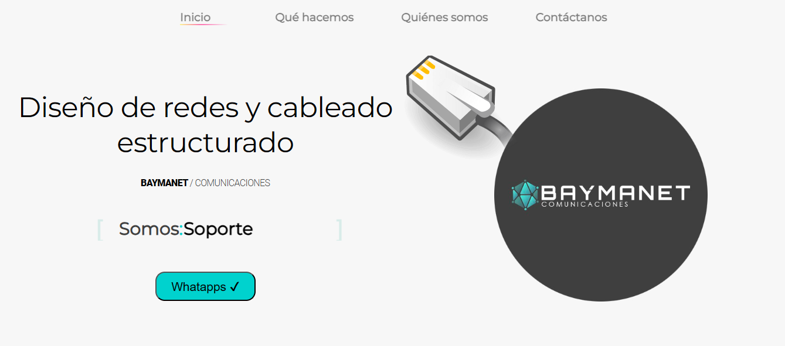
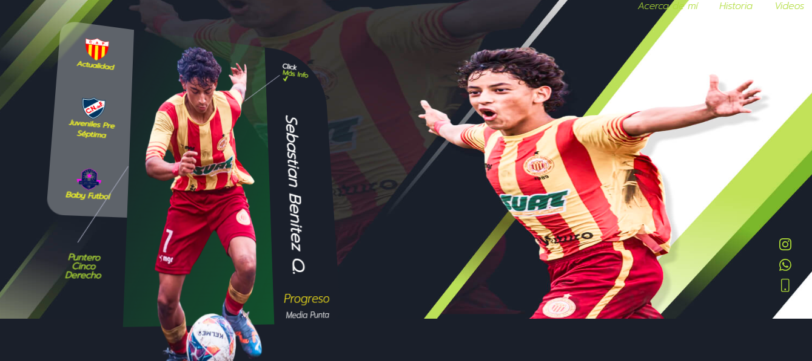
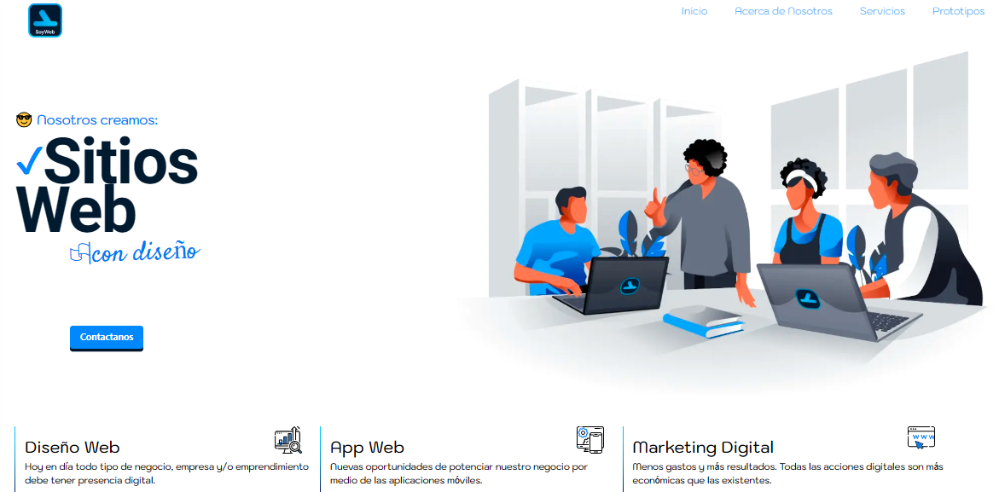
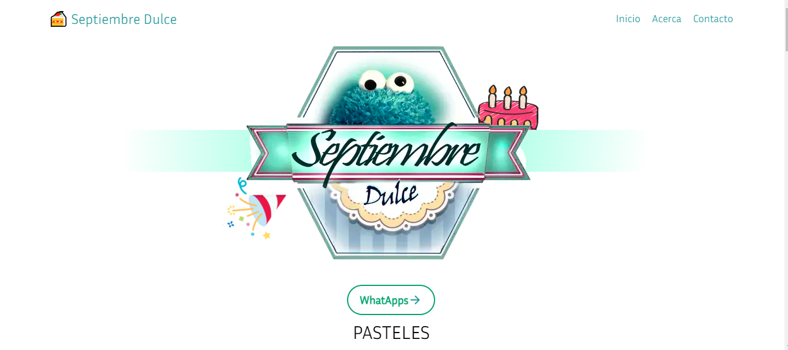
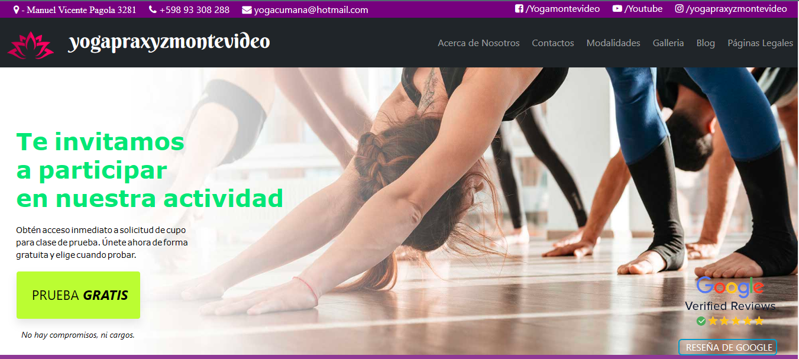

<h1 align="center">Hola, soy <a href="https://aristi.dev">Sebastian Benitez </a> 👋</h1>

## Sobre mi

- ⭐ NextJS ⭐ 
- 📲 ReactJS  
- ✏️ Astro
- 🧑‍🏫 HTML JS CSS
 

## Proyectos *web*

<table>
<tr>
<td width="50%">
<h3 align="center">Baymanet</h3>

Aprende a programar aplicaciones <strong>Android con Kotlin nivel intermedio</strong> - En este curso nos centraremos en las <strong>buenas prácticas, arquitectura y testing</strong>. Curso <strong>GRATUITO de 8 horas</strong> con todo el código disponible para descargar.

                                                                                     
</td>     
<td width="50%">
<h3 align="center">Progreso FC</h3>

   

  

Aprende a programar aplicaciones <strong>multiplataform con Kotlin y Jetpack Compose</strong> - En este curso nos centraremos en dominar Kotlin Multiplatform <strong>desde cero</strong>. Curso <strong>GRATUITO</strong> (en desarrollo) con todo el código disponible para descargar.

                                                                                      
</td>  
</table>                                                                                 

 
<table>
<tr>
<td width="50%">
<h3 align="center">Soy una Web</h3>

SoyUNaWeb</strong> - Una web de diseño creada por mí se enfoca en ofrecer soluciones creativas y visuales para marcas y proyectos. <strong>2023</strong> El código disponible para descargar.

                                                                                      
</td>
<td width="50%">
 
<h3 align="center">Soy una Web 2.0</h3>

                                       

 

 

SoyUNaWeb Version 2</strong> -  Con un enfoque en la estética moderna, la navegación intuitiva y la optimización de la experiencia de usuario, . <strong>2023</strong> El código disponible para descargar.

</td>  
</table>                                                                                 

 

<table>
<tr>
<td width="50%">
<h3 align="center">Septiembre Dulce</h3>

Aprende a programar aplicaciones <strong>Android con Kotlin desde cero</strong> - En este curso aprenderás todo lo necesario ya que no es necesario ningún conocimiento previo. Curso <strong>GRATUITO de 12 horas</strong> con todo el código disponible para descargar.

                                                                                      
</td>

<td width="50%">
                
<h3 align="center">YogaPraxysMontevideo</h3>

                                       

 

Las arquitecturas son <strong>IMPRESCINDIBLES</strong> para poder trabajar como desarrollador/a Android. En este curso, divido por ramas irás aprendiendo a implementar una arquitectura real y robusta con inyección de dependencias, clean architecture, testing y mucho más.

                                                             
</table>                                                                                 

 

### ⚙️ &nbsp;GitHub Analytics

