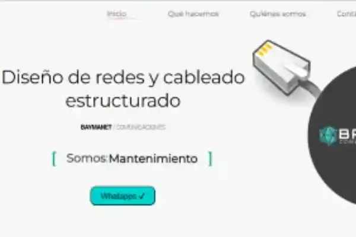
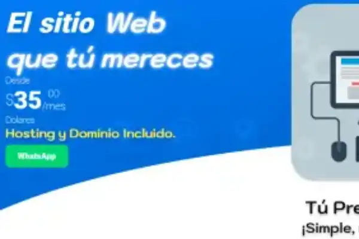

# ¡Hola, soy Sebastian Benitez! 👋
# 

## Video de ejemplo

[

Soy un **desarrollador** apasionado por la tecnología, con experiencia en [Lenguajes/Tecnologías principales], y me encanta colaborar en proyectos de software open-source. ¡Bienvenido a mi perfil de GitHub! Aquí podrás encontrar una variedad de proyectos en los que he trabajado y colaborado.

## 🚀 Tecnologías y Herramientas

- **Lenguajes**: [JavaScript, Python, Java, etc.]
- **Frameworks**: [React, NextJS, Astro, Node.js, etc.]
- **Bases de Datos**: [MongoDB, MySQL, etc.]

## 🔧 Proyectos Destacados

Aquí tienes algunos de los proyectos más interesantes en los que he trabajado:

### [Proyecto 1](https://baymanet.com/)
Diseño y desarrollo web de empresa Baymanet.
## Imágenes de ejemplo

    

### [Proyecto 2](https://github.com/tu-usuario/proyecto2)
Descripción de otro proyecto importante en el que has participado o dirigido.

    
  
 

### [Proyecto 3](https://github.com/tu-usuario/proyecto3)
Otro proyecto destacable. Puedes añadir capturas de pantalla, enlaces a demo o cualquier información relevante.

     

## 📝 Blog y Artículos

Aparte de desarrollar software, también me gusta compartir conocimiento a través de artículos técnicos. Puedes leerlos en mi [Blog Personal](https://tu-blog.com).

- [Artículo 1](https://tu-blog.com/articulo1) - Descripción breve del artículo.
- [Artículo 2](https://tu-blog.com/articulo2) - Descripción breve del artículo.

## 🌱 En qué estoy trabajando actualmente

- Mejorando mis habilidades en **[tecnología específica]**.
- Contribuyendo a proyectos open-source en **[nombre del proyecto]**.
- Explorando nuevas herramientas en **DevOps** y **machine learning**.

## 💬 Cómo contactarme

- **Email**: bmsebastian2@gmail.com
- **LinkedIn**: [[Enlace a tu perfil](https://linkedin.com/in/tu-perfil)](https://www.linkedin.com/in/sebastian-mandirola/)
- **Twitter**: [@tu-usuario](https://twitter.com/tu-usuario)

## 🏆 Logros y Reconocimientos

- Premios y menciones destacadas.
- Contribuciones a proyectos reconocidos o artículos populares.

